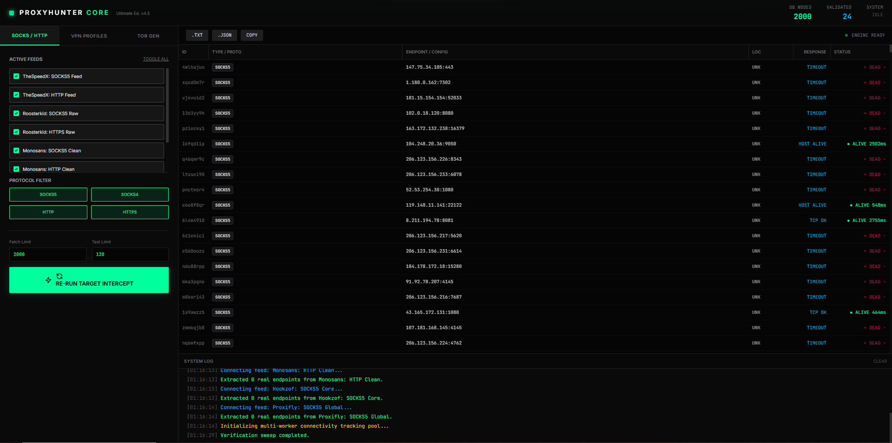
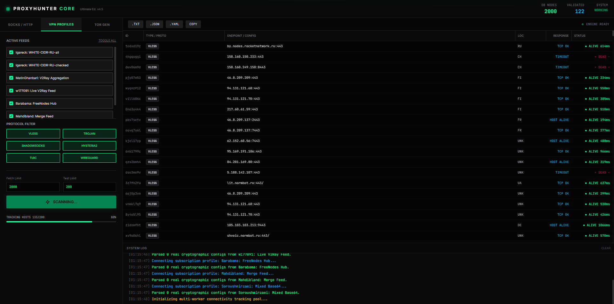
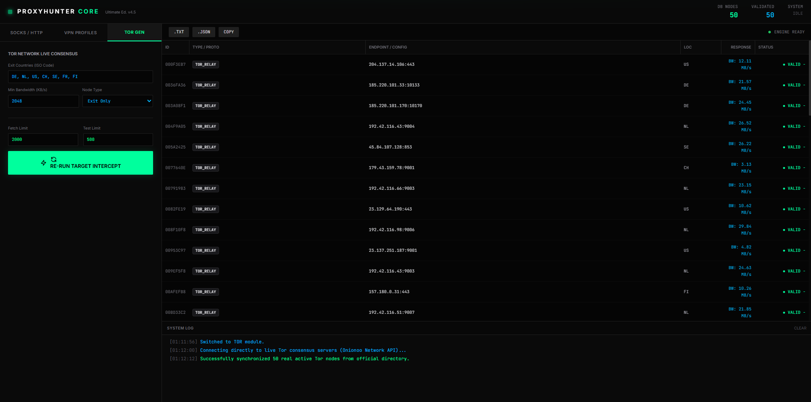

# ProxyHunter Core 2026 | Ultimate Edition v4.0

A modern, cyberpunk-styled single-page application (SPA) dashboard designed for aggregating, monitoring, and exporting anti-censorship configurations. The tool centralizes traditional proxy lists, next-generation VPN protocols, and Tor network routing circuits into a unified control panel.

---

## ⚡ Core Features

* **SOCKS / HTTP Module:** Aggregates public proxy lists from popular GitHub repositories (such as TheSpeedX, Roosterkid, and Hookzof).
* **VPN Profiles Module:** Parses and processes subscription feeds for advanced protocols: *VLESS-Reality, Trojan, Hysteria2, WireGuard, Tuic, and AmneziaWG*. Includes integrated interactive captcha handling for profile generators (e.g., VPNJantit).
* **TOR GEN Module:** Builds optimal Tor routing configurations based on custom geographic criteria (Exit Countries), bandwidth filters, and uptime status.
* **System Log:** A live, interactive console featuring precise timestamps and color-coded event logging (Info, Success, Warning, Error).
* **Smart Data Export:** Supports one-click exporting for valid configurations into multiple formats:
    * `.TXT` — Raw proxy lines or URI links.
    * `.JSON` — Complete node database metadata.
    * `.YAML` — Ready-to-use proxy groups configuration for the **Clash** client.
    * `COPY` — Instantly copies all valid node strings to the clipboard.

---

## 🛠 Tech Stack

* **Frontend:** Clean HTML5 / Vanilla JS (ES6+).
* **Styling:** Tailwind CSS (via CDN) + custom CSS enhancements (matrix grid background animations, holographic glow effects, interactive UI glitch states, and customized scrollbars).
* **Typography:** Google Fonts (*JetBrains Mono* for data tables and logs, *Inter* for the interface layout).

---

## 💻 Setup & Usage Instructions

Since this is a client-side Single Page Application (SPA), it requires no installation, Node.js server environment, or local dependencies.

1. Copy the source code and save it locally as a `main.html` file.
2. Double-click the file to open it in any modern web browser (Chrome, Firefox, Edge, Opera).
3. To start the simulation, select your desired module tab, check the active source feeds, and click the **"LAUNCH SCANNER"** button.

> ⚠️ **Prerequisite:** An active internet connection is required to load the Tailwind CSS framework and web fonts from external CDN repositories.

---

## 📦 Output Data Formats

* **SOCKS/HTTP:** Standard `IP:PORT` format.
     

* **VPN:** Native URI connection strings (e.g., `vless://...`) or a valid YAML proxy array structured for Clash:
    ```yaml
    proxies:
      - {name: "DE-vless83", type: vless, server: node-0.net, port: 443}
    ```
    

* **Tor:** A deployment-ready configuration string for your local `torrc` file:
    ```text
    EntryNodes DF73A1... StrictNodes 1
    ```
    

---

## 🛑 Disclaimer / Project Status

> **NOTE:** This project is a **frontend interface prototype (UI/UX) featuring a deep mock-simulation of backend logic**. The source fetching, proxy validation, and latency checks (ping calculations) are generated programmatically on the client side using random timers and `setTimeout` functions. No actual network connections are established to the referenced scraper endpoints.
